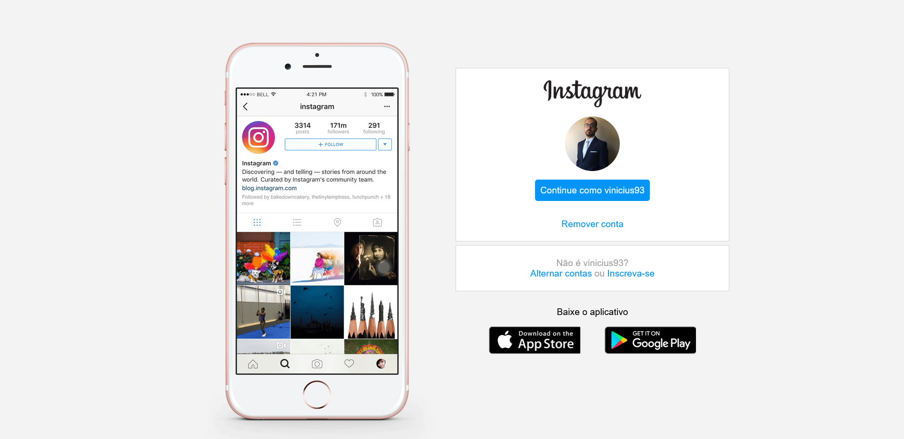

# Instagram landing page clone

## Overview

### Screenshot

## My process

### Built with

-   Semantic HTML5
-   CSS
-   Flexbox

### What i learned

In this project i was able to practice and use CSS Flexbox to build a responsive clone of Instagram's landing page.

## Author

-   GitHub - Vinícius dos Santos Verissimo (https://github.com/viniciusdsv93)
