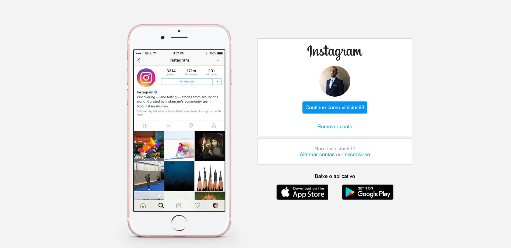

# Instagram landing page clone

## Visão Geral

### Screenshot

## Meu processo

### Construído com

-   HTML5 semântico
-   CSS
-   Flexbox

### O que aprendi

Neste projeto eu pude praticar e usar o CSS Flexbox para construir um clone responsivo da landing page do Instagram.

## Autor

-   GitHub - Vinícius dos Santos Verissimo (https://github.com/viniciusdsv93)
